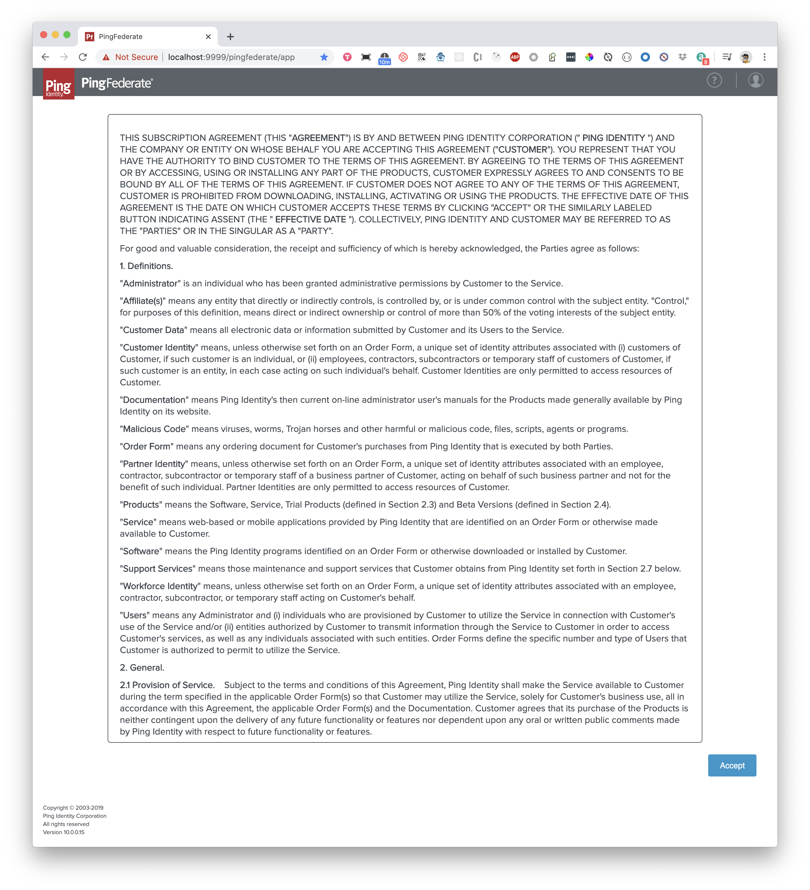
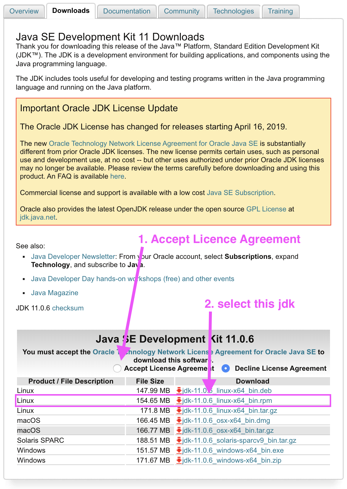

# PingFederate Docker
> Quick and easy way to standup a PingFederate server using Docker 

## Quick Start

1. Run From Docker Image associated with this repo:
    ```bash
    docker run -dt --name dev_pingfederate -p 9999:9999 -p 9031:9031 flavioespinoza/pingfederate-docker bash
    ```
1. Verify a container named `dev_pingfederate` is up and running:'
    ```bash
    docker ps -a
    ```

    ```bash
    CONTAINER ID        NETWORKS            STATUS              NAMES               PORTS
    bd2d1471591f        bridge              Up 51 seconds       dev_pingfederate    0.0.0.0:9031->9031/tcp, 0.0.0.0:9999->9999/tcp
    ```

1. Go to: https://localhost:9999/pingfederate/app and follow the prompts:
    


## Setup Your Own Docker Image

1. Install npm packages with yarn
    ```bash
    yarn install
    ```

1. Go to the link below and download the latest PingFederate ZIP file and save it in the project's root directory:
    - [PingFederate Download](https://www.pingidentity.com/en/resources/downloads/pingfederate/other.html)
    - **NOTE**: This file will be ignored on git commit

1. Go to the link below and download the latest `jdk-8u91-linux-x64.rpm` file and save it in the project's root directory:
    - [Java SE Development Kit 11 Downloads](https://www.oracle.com/technetwork/java/javase/downloads/jdk11-downloads-5066655.html)
    - You will need to signup for an Oracle account 
    - **NOTE**: This file will be ignored on git commit
    


1. Create docker-hub repo named `pingfederate-docker`:
    ```bash
    <your_dockerhub_repo>/pingfederate-docker
    ```

1. Build docker image
    ```bash
    docker build -t <your_dockerhub_repo>/pingfederate-docker -f Dockerfile.release .
    ```

1. Push docker image
    ```bash
    docker push <your_dockerhub_repo>/pingfederate-docker:latest
    ```

1. Run docker image with name `dev_pingfederate` and map admin and playground to your localhost ports 9999 and 9031:
    ```bash
    docker run -dt --name dev_pingfederate -p 9999:9999 -p 9031:9031 <your_dockerhub_repo>/pingfederate-docker bash
    ```

1. Verify a container named `dev_pingfederate` is up and running:'
    ```bash
    docker ps -a
    ```

    ```bash
    CONTAINER ID        NETWORKS            STATUS              NAMES               PORTS
    bd2d1471591f        bridge              Up 51 seconds       dev_pingfederate    0.0.0.0:9031->9031/tcp, 0.0.0.0:9999->9999/tcp
    ```

1. Go to: https://localhost:9999/pingfederate/app and follow the prompts:
    
